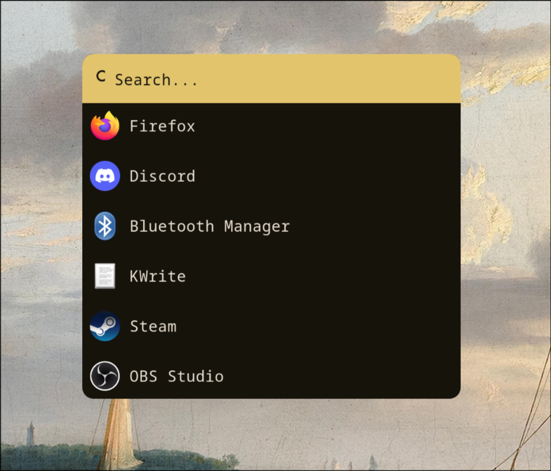
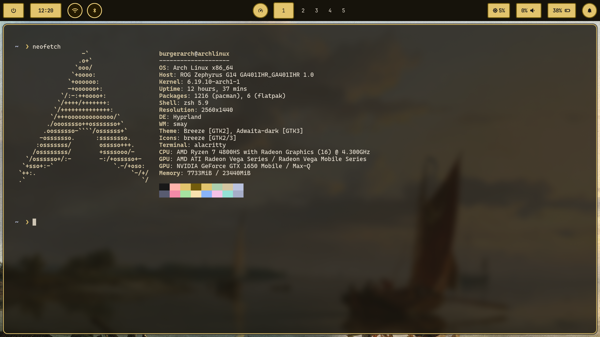

# Dotfiles
burgerarch@archlinux 🍸

## Эй, братан!
Rice for **Hyprland** on Arch Linux.
Running on **Asus Zephyrus G14**

## Features
- Dynamic **Waybar**
- Custom Transition **Wallpaper Script**
- Minimal Rice

## Demo

## Rofi

## Waybar + Neofetch

## Contents
- [`alacritty`](./dotfiles/alacritty) → terminal config
- [`firefox`](./dotfiles/firefox) → browser theme
- [`hypr`](./dotfiles/hypr) → window manager
- [`neofetch`](./dotfiles/neofetch) → info
- [`rofi`](./dotfiles/rofi) → launcher + powermenu
- [`waybar`](./dotfiles/waybar) → status bar
- [`zsh`](./dotfiles/zsh) → shell configs

## Huge Inspo
Felix my man. Thank you so much for pushing me down this rabbit hole [pewds](https://github.com/pewdiepie-archdaemon) 👊.
